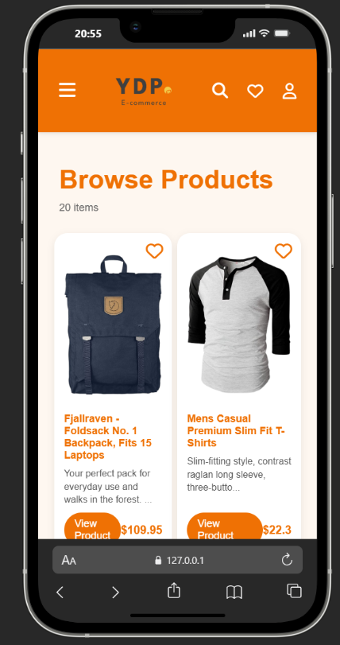
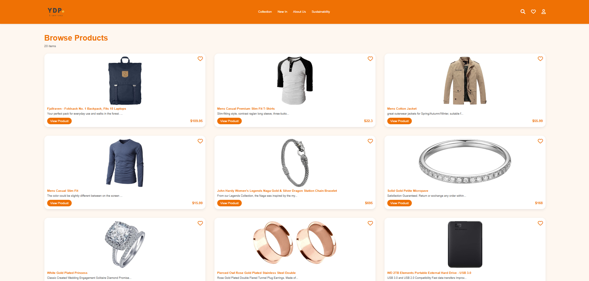

# Mini Project - Product Showcase

A simple responsive web project to browse products using the [Fake Store API](https://fakestoreapi.com/).  
Built with **HTML**, **CSS**, and **JavaScript**.  

---

## Features

- Responsive navigation bar with:
  - Logo
  - Menu links (`Collection`, `New In`, `About Us`, `Sustainability`)
  - Search, Favorite, and Profile icons
  - Hamburger menu for mobile devices
- Content section displaying products in a **grid layout**
- Dynamic product loading using **Fake Store API**
- Interactive favorite heart icons on each product
- Hover effects and responsive design for desktop and mobile

---

## Demo
  


  
 

---

## Installation

1. Clone the repository:

```bash
git clone https://github.com/yourusername/mini-project.git
```

2. Open `index.html` in your browser.

No additional dependencies are required.

---

## File Structure

```
mini-project/
│
├─ index.html       # Main HTML file
├─ style.css        # Styling for the project
├─ script.js        # JavaScript for dynamic product loading
└─ images/          # Project images (logo, screenshots, etc.)
```

---

## Usage

- Open `index.html` in any modern web browser.
- Browse products, click heart icons to favorite items.
- Resize the browser to see responsive behavior.

---

## Technologies Used

- HTML5
- CSS3
- JavaScript (ES6)
- Font Awesome Icons
- Fake Store API

---

## License

This project is licensed under the MIT License.  

---

## Author

- FS_Pemika – [GitHub](https://github.com/Px224)